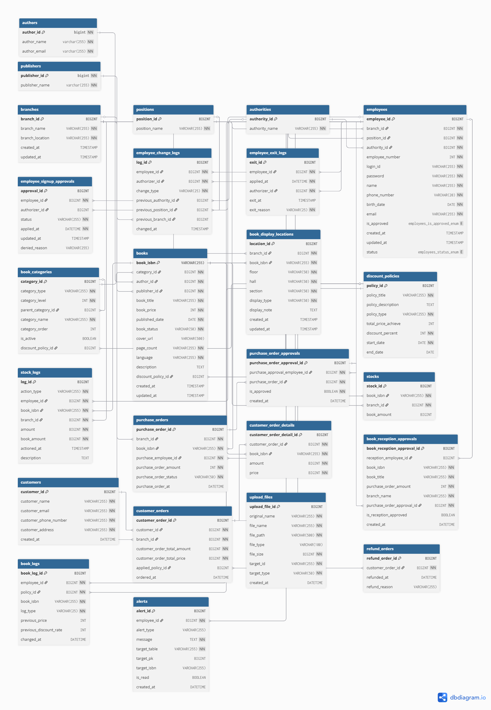

# BookHub_v2

    <strong>개발 기간</strong> : 2025.04 ~ 2025.07  
    <strong>배포 주소</strong> : <a href="http://3.35.24.241/">http://3.35.24.241/</a>

본 프로젝트는 코리아IT아카데미 국비 교육 과정 중 진행된 팀 프로젝트를 기반으로, 
구조 개선을 위해 개인적으로 리팩토링한 버전입니다.

---

## 목차   
+ [프로젝트 소개](#프로젝트-소개)
+ [화면 소개](#화면-소개)
+ [기술 스택](#기술-스택)
+ [개인 리팩토링](#개인-리팩토링)
+ [설계 문서](#설계-문서)
+ [팀원 소개](#팀원-소개)

---

## 프로젝트 소개

> 도서 관리와 유통 기능 중심의 ERP 시스템입니다. 
> 권한 기반 접근 제어와 로그 기록을 통해 보안을 강화하고, 
> 발주 → 수령 → 재고로 이어지는 흐름을 시스템화하여 효율적인 도서 유통과 관리를 지원합니다.

### 주요 기능
+ **회원가입 / 로그인**
  
  사용자는 회원가입을 통해 시스템 접근 권한을 신청하고, 관리자의 승인을 받은 후 로그인할 수 있습니다.  
  로그인 시 JWT 토큰 기반 인증을 사용하여 보안을 강화합니다.
  
+ **권한을 통한 접근 제어**
  
  사용자는 직급에 따라 권한이 부여되고, 권한(STAFF, MANAGER, ADMIN)에 따라 접근할 수 있는 페이지와 기능이 제한됩니다.   
  이를 통해 민감한 정보 접근을 통제하고 권한 외 기능 사용을 방지합니다.
  
+ **사원 관리 / 도서 관리**
  
  관리자는 회원가입 승인 및 사원 정보 수정을 통해 사용자에게 권한을 부여할 수 있습니다.   
  도서 정보(작가, 출판사, 카테고리 등)을 등록 및 관리하여 ERP 내 도서 데이터를 체계적으로 유지합니다.
  
+ **발주 / 수령 / 재고 관리**
  
  재고가 부족할 경우 전송되는 알림을 통해 재고를 파악해서 발주 요청을 생성하고, 관리자의 승인을 통해 발주가 진행됩니다.
  발주한 도서는 해당 지점에서 수령할 수 있고, 입고량에 따라 자동으로 재고가 갱신됩니다. 재고 현황은 실시간으로 확인할 수 있습니다.
  
+ **로그 기록 및 관리**
  
  주요 이벤트(예: 회원가입 승인, 사원 정보 변경, 도서 정보 변경, 발주 승인, 수령 확인 등)을 로그로 기록하여 시스템 사용 이력을 추적할 수 있습니다. 이는 보안 및 업무 감사용으로 활용됩니다.
  
+ **알림 기능**
  
  회원가입 승인, 재고 부족, 발주 요청 등 주요 이벤트 발생 시 알림을 통해 사용자에게 실시간으로 정보를 전달합니다.    
  알림 목록을 통해 확인할 수 있고, 해당 이벤트를 처리할 수 있는 페이지로 이동할 수 있습니다.
  
+ **베스트셀러, 매출 통계**
  
  도서 판매 데이터를 기반으로 베스트셀러와 다양한 기준(기간별, 지점별 등)의 매출 통계 차트를 제공합니다.   
  관리자는 이를 통해 판매 추이, 인기 도서, 매출 변화 등을 시각적으로 파악할 수 있습니다.

---

## 화면 소개  

---

## 기술 스택
**프론트**   
 
 
 
 

**백엔드**  
 
 
 
 
 

**협업**  
 

**DevOps**   
 
 
 

---

## 개인 리팩토링
> 기존 팀 프로젝트를 기반으로, **백엔드 구조 개선과 기술 확장**을 목표로 개인 리팩토링을 진행했습니다. 
> 사용자 경험 향상, 인증 구조 정비, API 문서화, 배포 경험을 중점으로 개선하였습니다.

### 주요 리팩토링 사항

+ **예외 처리 개선**
  + @Valid, 커스텀 예외 적용
  + GlobalExceptionHandler 활용으로 예외 응답 통일화
    
+ **Spring Security 로그인 구조 개선**
  + UserDetails, UserDetailsService 구현
  + 비밀번호 암호화 및 인증 흐름 표준화
  + 권한 기반 접근 제어 로직 정비
    
+ **Swagger(OpenAPI) 도입**
  + REST API 명세 자동화
  + 프론트/백 개발 간 인터페이스 문서화 및 테스트 편의성 확보
    
+ **배포 환경 구성**
  + EC2 + Nginx + RDS 환경에서 독립 배포 수행
  + GitHub Actions를 통한 배포 자동화
    
+ **MyBatis 도입**
  + JPA로 처리하기 어려운 다중 조건 검색 및 조인 쿼리를 MyBatis로 분리 구현
  + XML 기반 SQL로 가독성과 유지보수성 확보

---

## 설계 문서
### 1. ERD

### 2. API 명세서

---

## 팀원 소개

| 이름       | 고혁재 | 성재원 | 장소정 | 최서윤 |
|------------|--------|--------|--------|--------|
| 역할       | 백/프론트 | 백/프론트 | 백/프론트 | 백/프론트 |
| 담당 기능  | 로그인, JWT 토큰 인증, 권한 제어, 사원 관리,  이메일 전송 기능 | 도서 관리 (도서 CRUD, 도서 로그 기록),  수령 확인,  알림 기능, 메인화면 구성 | 작가 CRUD,  발주 및 발주 승인,  베스트셀러, 매출 통계,  리팩토링, 배포 | 출판사 CRUD,  재고 관리(재고 변경, 재고 로그 기록),  매출 통계,  헤더 및 사이드바 구현 |

